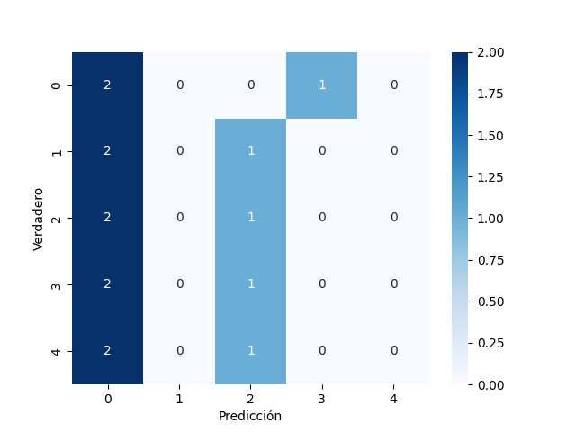
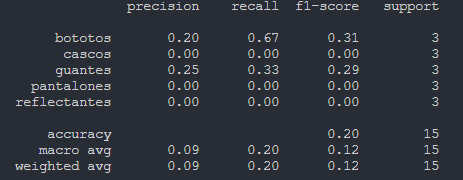
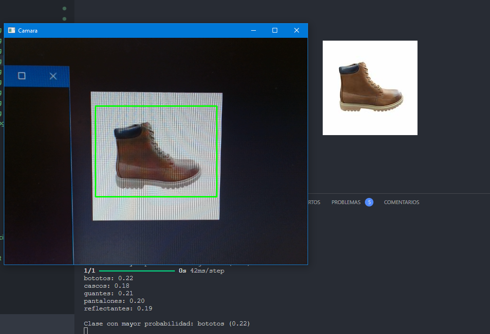

# Reconocimiento de Imágenes de Productos con CNN - Evaluación 2 - Machine Learning - Sección 
Repositorio disponible en: [https://github.com/SebaMorales74/machine-learning-inacap-evaluacion-2](https://github.com/SebaMorales74/machine-learning-inacap-evaluacion-2)

## Marco Teórico

El reconocimiento de imágenes es una tarea fundamental en el campo de la visión por computadora. Consiste en identificar y clasificar objetos dentro de una imagen. Las redes neuronales convolucionales (CNN) son una clase de redes neuronales profundas que han demostrado ser altamente efectivas para tareas de reconocimiento de imágenes debido a su capacidad para capturar características espaciales y patrones jerárquicos en los datos de imagen.

### Redes Neuronales Convolucionales (CNN)

Las CNN están compuestas por varias capas, incluyendo capas convolucionales, capas de pooling y capas completamente conectadas. Las capas convolucionales aplican filtros a la imagen de entrada para extraer características locales, mientras que las capas de pooling reducen la dimensionalidad de las características extraídas, manteniendo la información más relevante. Finalmente, las capas completamente conectadas realizan la clasificación basada en las características extraídas.

### Aumento de Datos

El aumento de datos es una técnica utilizada para mejorar la generalización de los modelos de aprendizaje profundo. Consiste en aplicar transformaciones aleatorias a las imágenes de entrenamiento, como rotaciones, cambios de tamaño, flips y ajustes de brillo. Esto ayuda a crear un conjunto de datos más diverso y robusto, reduciendo el riesgo de sobreajuste.

## Objetivos

1. **Preparación de los Datos**:
   - Organizar las imágenes en carpetas, una por cada categoría de producto.
   - Aplicar técnicas de aumento de datos para mejorar la generalización del modelo.
   - Normalizar las imágenes para que sus valores estén entre 0 y 1.
   - Dividir los datos en conjuntos de entrenamiento, validación y prueba.

2. **Construcción del Modelo CNN**:
   - Implementar una red neuronal convolucional con al menos tres capas convolucionales seguidas de capas de max pooling.
   - Utilizar funciones de activación adecuadas, como ReLU para las capas ocultas y softmax para la capa de salida.
   - Implementar capas de Dropout para prevenir el sobreajuste.
   - Compilar el modelo usando una función de pérdida adecuada y un optimizador como Adam.
   - Entrenar el modelo durante un número razonable de épocas y mostrar tanto la precisión del entrenamiento como la validación en cada época.

3. **Evaluación del Modelo**:
   - Evaluar el modelo entrenado con los datos de prueba y reportar la precisión final obtenida.
   - Generar una matriz de confusión para evaluar el rendimiento del modelo en cada clase de producto.
   - Generar un reporte de clasificación que muestre métricas como precisión, recall y F1-score para cada categoría.
   - Implementar un umbral de confianza para las predicciones y manejar los casos donde la confianza del modelo sea baja.

## Resultados Esperados

- **Modelo Entrenado**: Un modelo de red neuronal convolucional capaz de clasificar imágenes de productos en al menos cinco categorías diferentes con alta precisión.
- **Matriz de Confusión**: Una matriz de confusión que muestre el rendimiento del modelo en cada clase de producto, permitiendo identificar posibles áreas de mejora.
- **Reporte de Clasificación**: Un reporte detallado que incluya métricas como precisión, recall y F1-score para cada categoría, proporcionando una visión completa del rendimiento del modelo.
- **Predicciones en Tiempo Real**: Un sistema de captura de video en tiempo real que utilice el modelo entrenado para predecir la clase de productos en imágenes capturadas por la cámara, con un umbral de confianza para manejar predicciones de baja confianza.

### Evaluacion graficada

 

### Resultados en crudo

 

### Funcionamiento del Modelo

## Ejecución del Código

1. **Preparación del Entorno**:
   - Instalar las dependencias necesarias utilizando `pip install -r requirements.txt`.

2. **Entrenamiento del Modelo**:
   - Ejecutar el script `main.py` para entrenar el modelo con las imágenes organizadas en carpetas dentro de la carpeta `productos`.

3. **Evaluación del Modelo**:
   - El script generará una matriz de confusión y un reporte de clasificación después de entrenar el modelo.

4. **Predicciones en Tiempo Real**:
   - El script también incluye una sección para capturar video en tiempo real y realizar predicciones utilizando el modelo entrenado.
  
## Conclusión

A través de Tensorflow/Keras podemos demostrar cómo utilizar redes neuronales convolucionales para el reconocimiento de imágenes de productos, aplicando técnicas de aumento de datos y normalización para mejorar la generalización del modelo. La implementación incluye la evaluación del modelo mediante una matriz de confusión y un reporte de clasificación, así como un sistema de predicciones en tiempo real con un umbral de confianza para manejar predicciones de baja confianza.